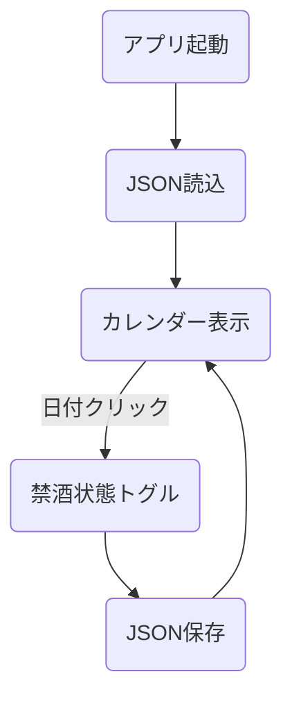

# abstinence-calendar 設計書（修正版）

## 1. アプリ概要
Compose Multiplatform (Desktopターゲット) を使用して、禁酒活動をサポートするカレンダーアプリを作成する。  
日ごとに「禁酒できた」か「飲んだか」を記録し、達成状況を可視化する。

## 2. 目的
- Kotlin + Compose Multiplatform (Desktop) 実践学習
- JSONファイルによるシンプルな永続化処理
- 状態管理・日付処理・色分けロジックの理解
- ファイル入出力（シリアライズ/デシリアライズ）の習得

## 3. 機能一覧

| 機能                     | 内容                                       |
|:--------------------------|:------------------------------------------|
| 月表示カレンダー           | 現在の月をカレンダー形式で表示             |
| 禁酒記録                  | 各日付をクリックして「禁酒できた/できなかった」を記録 |
| 色分け表示                | 土曜：青色、日曜・祝日：赤色、他は黒色     |
| JSON保存                  | ローカルファイル (`abstinence_record.json`) に禁酒記録を保存・復元する |
| 今日ハイライト            | 当日の日付を背景色変更でハイライト         |
| 月送り・今月戻りボタン    | 前月・今月・翌月へ移動できるナビゲーション |
| 禁酒記録の即時保存         | ○×切り替えと同時にファイルへ即保存         |

## 4. 処理概要

- アプリ起動時、`abstinence_record.json` を読み込む（存在しなければ空データ）
- カレンダーを描画し、禁酒記録を反映する
- 日付セルをクリックすると禁酒状態をトグル（未記録→○→×→未記録）
- 禁酒状態変更時、即座にファイル保存を行う
- 土日祝は自動で色分け、当日は青ハイライト

## 5. 処理詳細

### 5.1 カレンダー描画
- `YearMonth`からその月の全日付リストを生成
- 週単位 (`chunked(7)`) で行ごとに表示
- 各日付は土曜/日曜/祝日/平日によって色分けする
- 空白マスも必ず固定サイズBoxで均等配置

### 5.2 禁酒状態管理
- `mutableStateMapOf<LocalDate, Boolean?>`で管理（○: true、×: false、未記録: null）
- 状態はクリックで循環する
- `○/×`記号と色も一緒に表示

### 5.3 JSON保存・読込
- `kotlinx.serialization`でファイル保存
- 保存ファイル名：`abstinence_record.json`
- 保存フォーマット：`[{date: "YYYY-MM-DD", status: true/false}, ...]`
- 読込時にファイルが存在しない場合は空のマップで初期化

## 6. ディレクトリ構成と意味

```plaintext
src/main/kotlin/
├── Main.kt          // アプリ起動・画面構成・状態管理
├── holiday/         // 祝日情報を提供するパッケージ
│    └── HolidayProvider.kt
```

| ディレクトリ/ファイル名        | 役割                                        |
|:------------------------------|:--------------------------------------------|
| Main.kt                       | メイン画面描画・禁酒状態管理・保存/読込 |
| holiday/HolidayProvider.kt    | 日本の祝日リスト提供                       |

## 7. 画面イメージ

```plaintext
2025年4月

日 月 火 水 木 金 土
    1  2  3  4  5
6  7  8  9 10 11 12
13 14 15 16 17 18 19
20 21 22 23 24 25 26
27 28 29 30

- 日曜日・祝日：赤色
- 土曜日：青色
- 平日：黒色
- 当日：背景ハイライト
- 禁酒成功：○ 緑色
- 禁酒失敗：× 赤色
- 未記録：何も表示しない
```

## 8. フローチャート（Mermaid形式）



## 9. 使用技術
- Kotlin 1.9.10
- Compose Multiplatform Desktop
- kotlinx.serialization-json 1.6.0
- Java標準ライブラリ (`java.time`, `java.io.File`)

## 10. 備考
- `abstinence_record.json` はアプリ実行ディレクトリ直下に保存
- 保存ファイル破損時は安全にスキップしてアプリが起動
- 現状、禁酒記録以外（達成率表示など）は未実装（今後拡張可能）
