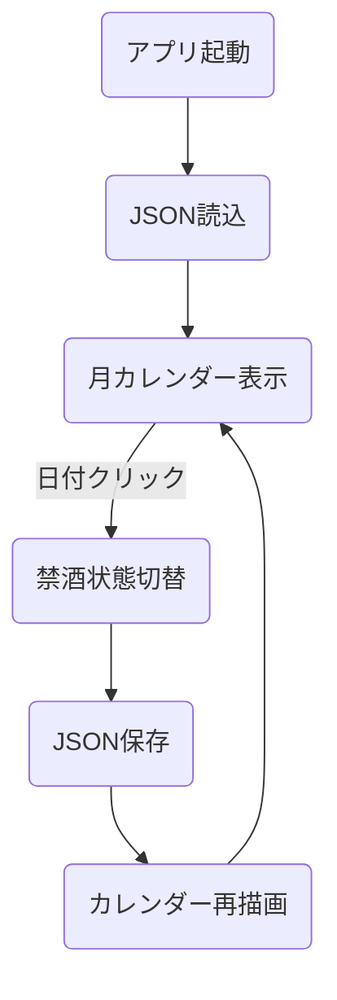

"# abstinence-calendar" 
# 禁酒カレンダーアプリ設計書（Compose Desktop版）

## 1. アプリ概要
Compose Multiplatform (Desktopターゲット) を使用して、禁酒活動をサポートするカレンダーアプリを作成する。  
日ごとに「禁酒できた」か「飲んだか」を記録し、達成状況を可視化する。

---

## 2. 目的
- Kotlin / Compose Multiplatformの実践学習
- JSONによる簡単な永続化処理の習得
- 状態管理と簡単なデータ保存処理の理解

---

## 3. 機能一覧

| 機能                     | 内容                                     |
|:--------------------------|:----------------------------------------|
| 月表示カレンダー            | 現在の月をカレンダー形式で表示する          |
| 禁酒記録                  | 各日付をクリックして「禁酒できた/できなかった」を記録 |
| 色分け表示                | 土曜：青色、日曜・祝日：赤色、他は黒色       |
| 禁酒達成率・連続日数の表示 | 月単位で禁酒達成率と連続記録を表示する        |
| JSON保存                  | ローカルファイルに禁酒記録を保存・復元する    |

---

## 4. 処理概要

- アプリ起動時、JSONファイルから禁酒記録を読み込む
- カレンダーを描画、各日付の状態に応じてマークを表示
- 日付クリックで禁酒状態をトグル（切り替え）
- 禁酒成功日は〇、失敗日は×で表示
- 状態変更時、自動でJSONファイルに保存

---

## 5. 処理詳細

### 5.1 カレンダー描画
- `YearMonth`でその月の日付一覧を生成
- `LocalDate`から曜日を取得
- 曜日と祝日に応じて色を設定

```kotlin
fun getDateColor(date: LocalDate): Color {
    return when {
        isHoliday(date) -> Color.Red
        date.dayOfWeek == DayOfWeek.SUNDAY -> Color.Red
        date.dayOfWeek == DayOfWeek.SATURDAY -> Color.Blue
        else -> Color.Black
    }
}
```

### 5.2 禁酒状態管理
- `AbstinenceRecord`クラスで日付と禁酒フラグを保持
- 禁酒状態はMap形式 (`LocalDate -> AbstinenceRecord`) で管理

### 5.3 JSON保存・読込
- `kotlinx.serialization` を使い、禁酒記録をシリアライズ/デシリアライズ
- 保存場所：`~/.abstinence_calendar/records.json`

---

## 6. ディレクトリ構成と意味

```plaintext
src/
├── Main.kt                // アプリ起動・画面構成メイン
├── view/
│   ├── CalendarView.kt    // 月表示カレンダー
│   └── DialogView.kt      // 禁酒記録ダイアログ（将来拡張）
├── model/
│   ├── AbstinenceRecord.kt // 禁酒記録データクラス
│   └── AbstinenceManager.kt// 禁酒記録の状態管理
└── storage/
    └── StorageManager.kt  // JSON保存/読込管理
```

| ディレクトリ/ファイル名   | 役割                                        |
|:---------------------------|:--------------------------------------------|
| Main.kt                    | エントリーポイント。画面切り替え・起動処理 |
| view/CalendarView.kt       | 月カレンダー描画とイベント処理               |
| view/DialogView.kt         | （拡張用）入力ダイアログ処理                  |
| model/AbstinenceRecord.kt  | 禁酒記録1件を定義                            |
| model/AbstinenceManager.kt | 禁酒記録リストの管理                          |
| storage/StorageManager.kt  | JSONファイルの読み書き管理                    |

---

## 7. 簡単な画面イメージ

```plaintext
2025年4月 禁酒カレンダー

日   月   火   水   木   金   土
○    ○    ×    ○    ○    ○    ○
○    ○    ○    ○    ×    ○    ○
○    ×    ○    ○    ○    ○    ○

連続禁酒日数: 5日
月禁酒達成率: 90%
```

- ○：禁酒できた
- ×：飲んでしまった
- 色分けあり（赤・青・黒）

---

## 8. フローチャート（Mermaid対応）



---

## 9. 使用技術
- Kotlin 1.9+
- Compose Multiplatform (Desktopターゲット)
- kotlinx.serialization
- java.time (LocalDate, YearMonth)
- Java NIO（ファイル入出力）

---

## 10. 備考
- 初回起動時、保存ファイル (`records.json`) がない場合は新規作成する
- 禁酒成功率や連続記録の更新はリアルタイムで反映される
- ファイル保存はユーザーディレクトリ配下（`.abstinence_calendar/`）を利用する
